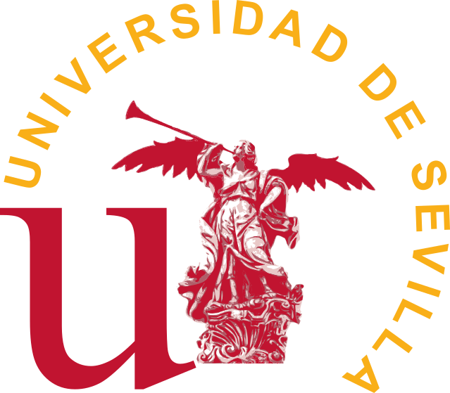

# Ingelectus-AICIA

---

## Acuerdo con AICIA

- **OE-PPC-018**: Desarrollo funcionalidad de SRAP
- **OE-PPC-020**: Validar con Acciona el control del PPC con plantas híbridas 
- **OE-PPC-023**: Acuerdo con AICIA mejora continua del PPC

---

## Acuerdo con AICIA

- **OE-PPC-027**: Evaluación del estado del simulador
- **OE-PPC-028**: Evaluación y mejora de la coordinación PPC durante FRT
- **OE-PPC-030**: Evaluación y mejora del PPC Híbrido PV+WT
- **OE-PPC-031**: Implementar la funcionalidad de hueco de tensión en los inversores

---

## Ley de control e implementación del PPC

- ¿Qué diferencia hay entre la Ley de control del PPC y la implementación del PPC?
- ¿Cómo es la Ley de control actual?
  - (P)**I** discreto
- ¿Qué se pude proponer?
  - LQR discreto con retrasos
  - N4SID
  - MPC
  - FO

---

## Propuesta de funcionalidades

- POD: Amortiguamiento de oscilaciones
- H: Inercia con PPC
- Optimización: 
  - Reparto de P y Q
  - Priorizar BESS, STATCOM, etc.
- EMS

---

## Sistema HIL

- **pydae** como motor de simulación y análisis
  - Todo python.
  - Por la portabilidad: Windows, Linux, Raspbian, etc.
  - No se requieren licencias.
  - DAE: Diferential Algebraic Equations (sistemas dinámicos).

---

